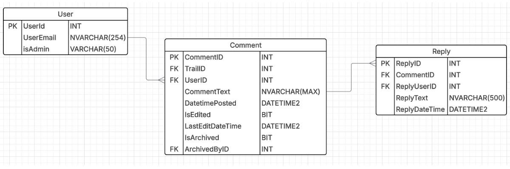
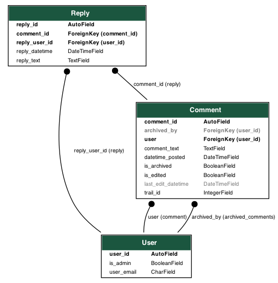

# COMP2001: CommentsService



CommentsService is a project I made for **COMP2001** at the University of Plymouth. It is a Django RESTful API that allows users to create, read and update comments on trails. It also includes authentication and authorisation features.

The Django project is **not** in the root, so you need to navigate to the `CommentsService` folder to run the Django commands directly; however, all testing can seamlessly be done via running the scripts in the `test/` directory; if you don't want to use the bash scripts you can instead run the commands in them manually (**Inside `2001-CommentsService/CommentsService`**)

In the image below, it shows the final logical database schema, automatically generated by Django (`python manage.py graph_models comments -o my_models.png`) directly based on the models.py file. It visualises the three core entities of the **CommentsService**: `User`, `Comment`, and `Reply`, along with their respective fields and data types.

This diagram clearly illustrates the *one-to-many* relationships that are central to the microservice's functionality. Each `Comment` is linked to a `User` as its author, and can have multiple replies. In turn, each `Reply` is linked back to its parent `Comment` and the `User` who wrote it.

The schema includes two separate foreign keys from `Comment` to `User`: the `user` field for the comment author and the `archived_by` field for the administrator who archives it. This design is a direct implementation of the system's business logic, which distinguishes between content ownership and administrative moderation, thereby fulfilling the brief's requirements. This structure, managed by the Django ORM, ensures referential integrity across the database.

### Project Structure for the Django Project (CommentsService/)

```
CommentsService/
├── comments        <--- Comments app folder with comment-related code
│   ├── migrations      <--- Migrations folder for the comments app which handles Django's database schema changes (auto generated)
│   │   ├── __init__.py         <--- Indicates this is a package (auto-generated empty file)
│   │   └── 0001_initial.py     <--- Database migrations for the initial and final schema of the comments app
│   ├── __init__.py     <--- Indicates this is a package (auto-generated empty file)
│   ├── apps.py         <--- Configuration for the comments app (auto generated)
│   ├── auth.py         <--- Authentication API implementation for the comments app
│   ├── models.py       <--- Models for the comments app (database schema)
│   ├── serialisers.py  <--- Serialisers for the comments app (converts models to JSON and vice versa)
│   ├── urls.py         <--- Where you define the URLs for the comments app
│   └── views.py        <--- Views for the comments app, i.e. the logical code that handles the API requests and responses
├── main        <--- Main folder with settings and urls (contains project-configuration code)
│   ├── __init__.py     <--- Auto-generated empty file previously clarified
│   ├── asgi.py         <--- ASGI configuration for the project (for asynchronous support)
│   ├── settings.py     <--- Project settings (contains MS-SQL database configuration, installed apps (comments/), middleware (not manually configured this time), pagination (10-requests-in-a-page), etc.)
│   ├── urls.py         <--- Project URLs (creates the actual URLs using the Django app's urls.py files)
│   └── wsgi.py         <--- WSGI configuration for the project (for synchronous support, on by default)
├── .env            <--- Environment variables for the project with the MS-SQL database credentials (should be git ignored in production but is not for markers' convenience)
└── manage.py.      <--- Central script that Django uses to manage the project (running the server, making migrations, creating apps, etc.)
```

In Django, an `app` refers to a folder (i.e. feature) inside the project

### User Setup

1. Clone the repository:

   ```bash
   git clone https://github.com/alfie-ns/2001-CommentsService
   ```
2. Run the service:

   **Option A: Bash script (automates everything)**

   ```bash
   cd 2001-CommentsService && ./scripts/run.sh
   ```

   **Option B: Manual setup**

   ```bash
   cd 2001-CommentsService
   python3 -m venv venv && source venv/bin/activate
   pip3 install -r requirements.txt
   cd CommentsService
   python3 manage.py runserver
   ```

### My Initial Setup

On the "Starting" commits, I ran the following commands to set up the Django project:

1. run `python3 -m venv venv` to create virtual environment
2. run `source venv/bin/activate` (or whatever you named the virtual environment) to enter it
3. run `pip3 install django djangorestframework` to install both of those packages
4. run `pip3 freeze > requirements.txt` to store the dependencies, to reinstall to the venv on new clones by running `pip3 install -r requirements.txt`
5. run `django-admin startproject CommentsService` to create the Django project
6. run `cd CommentsService` then `python3 manage.py migrate` to migrate the database
7. run `pip3 install mssql-django python-dotenv` to install the database driver and dotenv package
8. run `python3 manage.py startapp comments` to create the comments app which holds the implementation of the comments microservice
